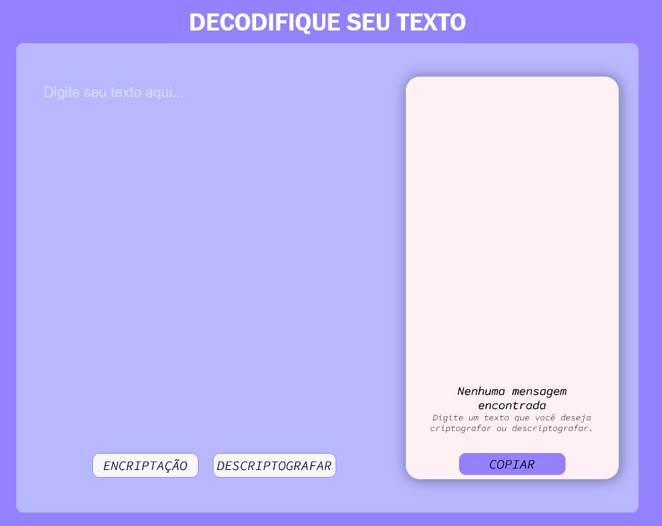

## Challenge Oracle+Alura = Decodificador de texto. 

Realizando o curso da Oracle em parceria com a Alura, foi nos apresentado um challenge para a criação e desenvolvimento de um decodificador de textos. 

Era necessário criptografar o texto informado, aprenseta-lo em uma janela ao lado e ao copiar o conteudo criptogrado, descriptografalo para o texto original. 

Utilizando a biblicote **CryptoJS**, pude impletar essa criptografia e descriptografia de forma fácil, prática e rápida, presando pelo código limpo e simples. 

Com auxilio do **Figma**, nos apresentaram moldais para a criação, mas tambem nos dando total liberdade para a imaginação e de como mais gostariamos de implentar esse sistema. 

## Imagens do meu decodificador:

