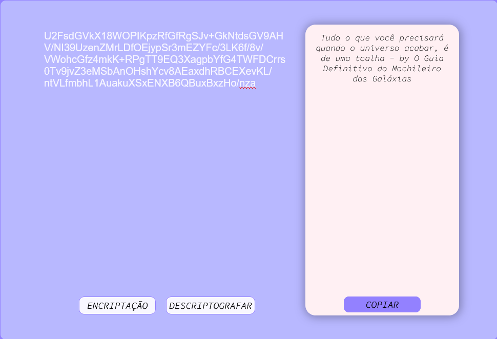
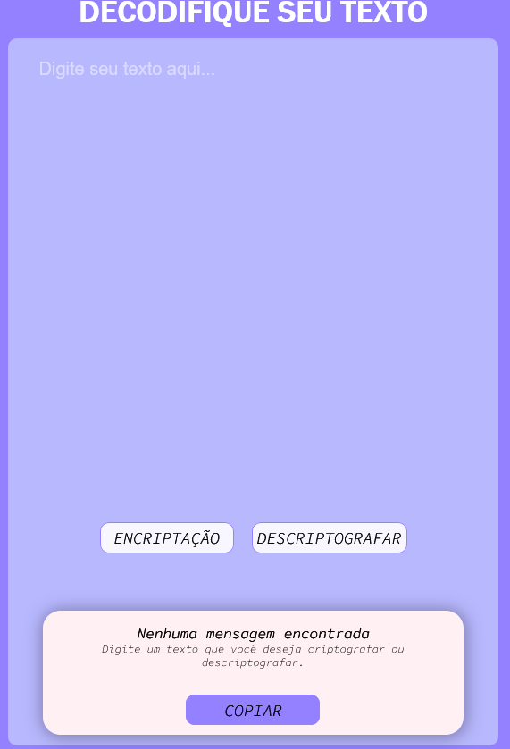

## Challenge Oracle+Alura = Decodificador de texto. 

Realizando o curso da Oracle em parceria com a Alura, foi nos apresentado um challenge para a criação e desenvolvimento de um decodificador de textos. 

Era necessário criptografar o texto informado, apresenta-lo em uma janela ao lado e ao copiar o conteúdo criptografado, descriptografado para o texto original. 

Utilizando a biblioteca **CryptoJS**, pude implementar essa criptografia e descriptografia de forma fácil, prática e rápida, presando pelo código limpo e simples. 

Com auxilio do **Figma**, nos apresentaram moldais para a criação, mas também nos dando total liberdade para a imaginação e de como mais gostaríamos de implementar esse sistema, não esquecendo da responsividade para o ambiente mobile. 

## Imagens do meu decodificador:

# Link para interagir e decodificar seus textos: <a href="https://anasouza.top/src_02/index.html">Clique aqui<a>
